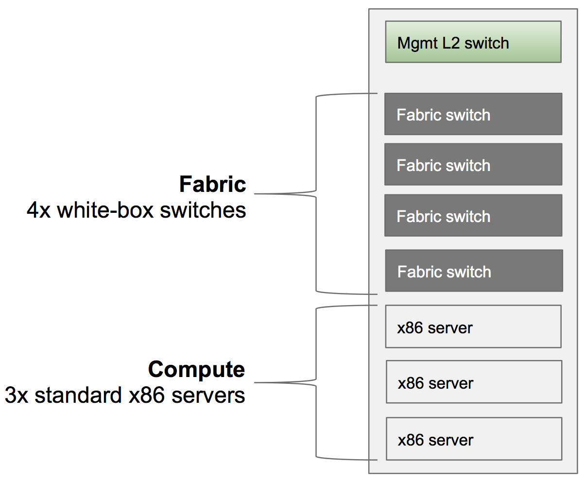
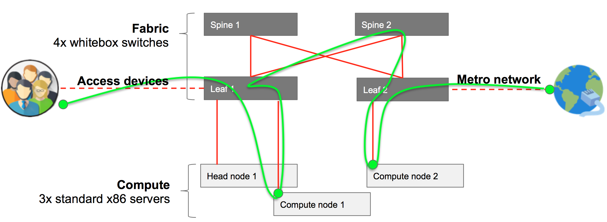
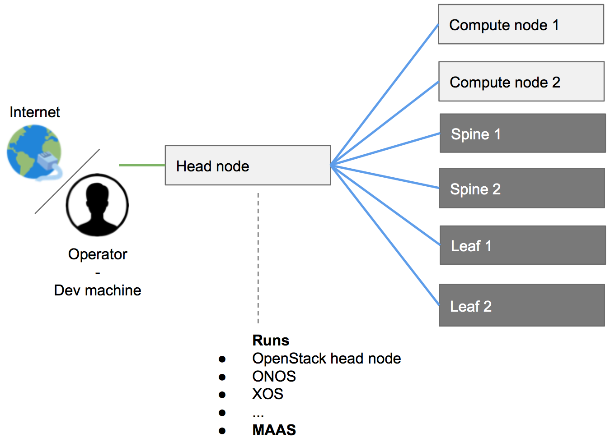
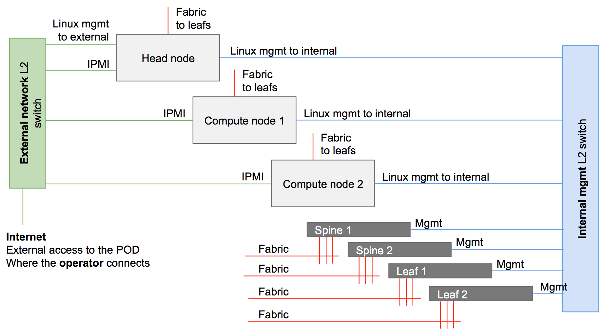

# Installing a Physical POD

The following is a detailed, step-by-step recipe for installing a physical POD
with multiple physical servers and switches.

If you are new to CORD and would like to get familiar with it, you should start
by [bringing up a virtual POD on a single physical server](install_virtual.md).

## Overview of a CORD POD

The following is a brief description of a full physical POD.

### Physical Configuration

A full POD includes a Top-of-Rack (ToR) management switch, four fabric
switches, and three standard x86 servers.  The following figure does not show
access devices or any upstream connectivity to the metro network; those details
are included later in this section.



### Logical Configuration: Data Plane Network

The following diagram is a high level logical representation of a typical CORD POD.



The figure shows 40G data plane connections (red), where end-user traffic
goes from the access devices to the metro network (green). User traffic
goes through different different leafs, spines and compute nodes,
depending on the services needed, and where they are located. The
switches form a leaf and spine fabric. The compute nodes and the head
node are connected to a port of one of the leaf switches.

### Logical Configuration: Control Plane / Management Network

The following diagram shows in blue how the components of the system are
connected through the management network.



As shown in this figure, the head node is the only server in the POD connected
both to Internet and to the other components of the system. The compute nodes
and the switches are only connected to the head node, which provides them with
all the software needed.

## Sample Workflow

It is important to have a general picture of installation workflow before
getting into the details. The following is a list of high-level tasks involved
in bringing up a CORD POD:

* CORD software is downloaded and built on the dev machine.
* A POD configuration is created by the operator on the dev machine.
* The software is pushed from the dev machine to the head node.
* Compute nodes and fabric switches need to be manually rebooted. The CORD
  build procedure automatically installs the OS, other software needed and
  performs the related configurations.
* The software gets automatically deployed from the head node to the compute
  nodes.

## Requirements

While the CORD project is for openness and does not have any interest in
sponsoring specific vendors, it provides a reference implementation for both
hardware and software to help users in building their PODs. What is reported
below is a list of hardware that, in the community experience, has worked well.

Also note that the CORD community will be better able to help you debugging
issues if your hardware and software configuration look as much as possible
similar to the ones reported in the reference implementation, below.

## Bill Of Materials (BOM) / Hardware Requirements

The section provides a list of hardware required to build a full CORD POD.

### BOM Summary

| Quantity | Category                            | Brand         | Model              | Part Number    |
|----------|-------------------------------------|---------------|--------------------|----------------|
| 3        | Compute                             | Quanta (QCT)  | QuantaGrid D51B-1U | QCT-D51B-1U    |
| 4        | Fabric Switch                       | EdgeCore      | AS6712-32X         | AS6712-32X     |
| 1        | Management Switch (L2 VLAN support) | *             | *                  | *              |
| 7        | Cabling (data plane, fiber)         | Robofiber     | QSFP-40G-03C       | QSFP-40G-03C   |
| 12       | Cabling (management, copper)        | CAT6, 3M      | *                  | *              |

### Detailed Requirements

* 1x Development Machine. It can be either a physical machine or a virtual
  machine, as long as the VM supports nested virtualization. It doesn’t have to
  be necessarily Linux (used in the rest of the guide, below); in principle
  anything able to satisfy the hardware and the software requirements. Generic
  hardware requirements are 2 cores, 4G of memory, 60G of hdd.

* 3x Physical Servers: one to be used as head node, two to be used as compute
  nodes.

   * Suggested Model: OCP-qualified QuantaGrid D51B-1U server. Each server is
     configured with 2x Intel E5-2630 v4 10C 2.2GHz 85W, 64GB of RAM 2133MHz
     DDR4, 2x 500GB HDD, and a 40 Gig adapter.

   * Strongly Suggested NIC:
       * Intel Ethernet Converged Network Adapters XL710 10/40 GbE PCIe 3.0, x8
         Dual port.
       * ConnectX®-3 EN Single/Dual-Port 10/40/56GbE Adapters w/ PCI Express
         3.0.

> NOTE: while the machines mentioned above are generic standard x86 servers,
> and can be potentially substituted with any other machine, it’s quite
> important to stick with either one of the network card suggested.  CORD
> scripts will look for either an `i40e` or a `mlx4_en` driver, used by the two
> cards. To use other cards additional operations will need to be done. Please,
> see [Network Settings](appendix_network_settings.md) for more information.

* 4x Fabric Switches
     * Suggested Model: OCP-qualified Accton 6712 switch. Each switch is
       configured with 32x40GE ports; produced by EdgeCore and HP.

* 7x Fiber Cables with QSFP+ (Intel compatible) or 7 DAC QSFP+ (Intel
  compatible) cables

     * Suggested Model: Robofiber QSFP-40G-03C QSFP+ 40G direct attach passive
       copper cable, 3m length - S/N: QSFP-40G-03C.

* 1x 1G L2 copper management switch supporting VLANs or 2x 1G L2 copper
  management switches

## Connectivity Requirements

The dev machine and the head node have to download software from different
Internet sources, so they currently need unfettered Internet access.  (In the
future, only the dev machine, and not the head node, will require Internet
connectivity.) Sometimes firewalls, proxies, and software that prevents to
access local DNSs generate issues and should be avoided.

## Cabling a POD

This section describes how the hardware components should be interconnected to
form a fully functional CORD POD.

### Management / Control Plane Network

The management network is divided in two broadcast domains: one connecting the
POD to the Internet and giving access to the deployer (called "external" and
shown in green in the figure below), and one connecting the servers and
switches inside the POD (called "internal" or "management" and shown in blue).
The figure also shows data plane connections in red (as described in the next
paragraph).



The external and the management networks can be separated either using two
different switches, or the same physical switch and by using VLANs.

> NOTE: Head node IPMI connectivity is optional.

> NOTE: IPMI ports do not have to be necessarily connected to the external
> network. The requirement is that compute node IPMI interfaces need to be
> reachable from the head node. This is possible also through the internal /
> management network.

> NOTE: Vendors often allow a shared management port to provide IPMI
> functionalities. One of the NICs used for system management (e.g., eth0) can
> be shared, to be used at the same time also as IPMI port.

#### External Network

The external network allows POD servers to be reached from the Internet. This
would likely not be supported in a production system, but is useful in
development and evaluation settings, for example, making it easy to directly
start/stop/reboot the head and the compute nodes.  Moreover, using CORD
automated scripts and tools for Jenkins pipeline requires Jenkins direct access
to these interfaces. This is why IPMI/BMC interfaces of the nodes are also
connected to the external network. In summary, following is the list of
equipment/interfaces usually connected to the external network:

* Internet
* Dev machine
* Head node - 1x 1G interface (following defined as external)
* Head node - 1x IPMI/BMC interface (optional)
* Compute node 1 - 1x IPMI/BMC interface (optional, but recommended)
* Compute node 2 - 1x IPMI/BMC interface (optional, but recommended)

#### Internal Network

The internal/management network is separate from the external one. It has the
goal to connect the head node to the rest of the system components (compute
nodes and fabric switches). For a typical POD, the internal network includes:

* Head node - 1x 1G interface (following defined as management)
* Compute node 1 - 1x 1G interface
* Compute node 2 - 1x 1G interface
* Fabric 1 - management interface
* Fabric 2 - management interface
* Fabric 3 - management interface
* Fabric 4 - management interface

### User / Data Plane Network

The data plane network (represented in red in the figure) carries user traffic
(in green), from the access devices to the point the POD connects to the metro
network.


The fabric switches are assembled to form a leaf and spine topology. A typical
full POD has two leafs and two spines. Currently, this is a pure 40G network.
While spines are not connected together, each leaf is connected to both spines.
In summary, the following are the devices connecting to the leaf switches:

* Head node  - 1x 40G interface
* Compute node 1 - 1x 40G interface
* Compute node 2 - 1x 40G interface
* Access devices - 1 or more 40G interfaces
* Metro devices - 1 or more 40G interfaces

### Best Practices

The community follows a set of best practices to better be able to remotely
debug issues, for example via mailing-lists. The following is not mandatory,
but is strongly suggested:

* Leaf nodes are connected to the spines nodes starting at the highest port
  number on the leaf.

* For a given leaf node, its connections to the spine nodes terminate on the
  same port number on each spine.

* Leaf _n_ connections to spine nodes terminate at port _n_ on each spine node.

* Leaf-spine switches are connected into the management TOR starting from the
  highest port number.

* Compute node _n_ connects to the internal (management) network switch on port
  _n_.

* Compute node _n_ connects to its leaf at port _n_.

* The head node connects to the internal (management) network using the lowest
  1G management interface.

* The head node connects to the external network using its highest 1G
  management interface.

* All servers connect to the leafs using the lowest fabric (40G NIC) interface.

## Software Environment Requirements

Only the dev machine and the head node need to be prepped for installation.
The other machines will be fully provisioned by CORD itself.

### Development Machine

It should run either Ubuntu 16.04 LTS (recommended) or Ubuntu 14.04 LTS.  See
[Configuring your Development
Environment](install.md#configuring-your-development-environment) for more
details.

This documentation assumes that you checked out the CORD source tree into
`~/cord`.

### Head Node

It should run Ubuntu 14.04 LTS.  Then, configure the following.

#### Create a User with "sudoer" permissions (no password)

```
sudo adduser cord && \
sudo adduser cord sudo && \
echo 'cord ALL=(ALL) NOPASSWD:ALL' | sudo tee --append /etc/sudoers.d/90-cloud-init-users
```

### Compute Nodes

The CORD build process installs the compute nodes. The only thing to be
configured are the BIOS settings, so that they can PXE boot from the head node
through the internal (management) network. In doing this, make sure that:

* The network card connected to the internal / management network is configured
  with DHCP (no static IPs).

* The IPMI (sometime called BMC) interface is configured with a statically
  assigned IP, reachable from the head node. It’s strongly suggested to have
  them deterministically assigned, so you will be able to control your node as
  you like.

* Their boot sequence has (a) the network card connected to the internal /
  management network as the first boot device; and (b) the primary hard drive
  as second boot device.

> NOTE: Some users prefer to connect as well the IPMI interfaces of the compute
> nodes to the external network, so they can have control on them also from
> outside the POD. This way the head node will be able to control them anyway.

### Fabric Switches: ONIE

The ONIE installer should be already installed on the switch and set to boot in
installation mode. This is usually the default for new switches sold without an
Operating System. It might not be the case instead if switches have already an
Operating System installed. In this case rebooting the switch in ONIE
installation mode depends by different factors, such the version of the OS
installed and the specific model of the switch.

## Prepare POD Configuration

Each CORD POD deployment requires a POD configuration file that describes how
the system should be configured, including what IP addresses should be used for
the external and the internal networks, what users the system should run during
the automated installation, and much more.

POD configuration files are YAML files with extension .yml, contained in the
`/cord/build/podconfig` directory in the dev VM. You can either create a new
file with your favorite editor or copy-and-edit an existing file. The
[rcord-physical-example.yml](https://github.com/opencord/cord/blob/master/podconfig/rcord-physical-example.yml)
configuration file is there for this purpose. All parameters have a
description. Optional lines have been commented out, but can be used as needed.

More information about how the network configuration for the POD can be
customized can be found in [Network Settings](appendix_network_settings.md).

A full set of all possible build system variables can be found in the [Build
System Variable Glossary](build_glossary.md).

Once the POD config YAML file has been created, the composite configuration
file should be generated with the following command.

```
cd ~/cord/build && \
make PODCONFIG={YOUR_PODCONFIG_FILE.yml} config
```

The process generates a set of files in `~/cord/build/genconfig`

> NOTE: Before the configuration process the `~/cord/build/genconfig` directory
> contains a README.md file only.

## Head Node Deployment

Head node deployment works as follows:

* Makes the head node a MAAS server from which the other POD elements (fabric
  switches and compute nodes) can PXE boot (both to load their OS and to be
  configured).
* Installs and configures the containers needed to configure other nodes of the
  network.
* Installs and configures OpenStack.
* Provisions XOS, which provides service provisioning and orchestration for the
  CORD POD.

This step is started with the following command:

```
cd ~/cord/build && \
make build
```

> NOTE: Be patient: this step can take an hour to complete.

> WARNING: This command sometimes fails for various reasons.  Simply re-running
> the command often solves the problem. If the command fails it’s better to
> start from a clean head node.

This step is complete when the command successfully runs.

### MAAS

As previously mentioned, once the deployment is complete the head node becomes
a MAAS region and rack controller, basically acting as a PXE server and serving
images through the management network to compute nodes and fabric switches
connected to it.

The Web UI for MaaS can be viewed by browsing to the head node, using a URL of
the from `http://head-node-ip-address/MAAS`.

To login to the web page, use `cord` as the username. If you have set a
password in the deployment configuration password use that, otherwise the
password used can be found in your build directory under
`<base>/build/maas/passwords/maas_user.txt`.

After the deployment process finishes, MAAS initiates the download of an Ubuntu
14.04 boot image that will be used to boot the other POD devices. This download
can take some time and the process cannot continue until the download is
complete. The status of the download can be verified through the UI by visiting
the URL `http://head-node-ip-address/MAAS/images/`, or via the command line
from head node via the following command:

```
APIKEY=$(sudo maas-region-admin apikey --user=cord) && \
maas login cord http://localhost/MAAS/api/1.0 "$APIKEY" && \
maas cord boot-resources read | jq 'map(select(.type != "Synced"))'
```

If the output of of the above commands is not an empty list ([]) then the
images have not yet been completely downloaded. Depending on your network
speed, this could take several minutes. Please wait and then attempt the last
command again, until the returned list is empty.

When the list is empty you can proceed.

### Compute Node and Fabric Switch Deployment

The section describes how to provision and configure software on POD compute
nodes and fabric switches.

#### General Workflow

Once it has been verified that the Ubuntu boot image has been downloaded, the
compute nodes and the fabric switches may be PXE booted.

Compute nodes and switches should be simply rebooted. The head node (through
MaaS) will act as DHCP and PXE server. It will install the OSs and will make
sure they are correctly configured.

At the end of the process, the compute and switch elements should be visible
through the CORD CLI utilities and MAAS.

> WARNING: make sure your computes nodes and fabric switches are configured as
> prescribed in the _Software Environment Requirements_ section.

#### Important Commands: cord harvest and cord prov

Two important commands are available to debug and check the status of the
provisioning. They can be used from the head node CLI.

* `cord harvest`: Tracks the nodes harvesting process. Nodes and switches
  should appear here, as soon as they get an IP and are recognized by MaaS. To
  see if your devices have been recognized, use the following command:

```
cord harvest list
```

* `cord prov`: Tracks the provisioning process, meaning the configuration
  process that happen soon after the OS has been installed on your devices. To
  see the provisioning status of your devices, use the following command:

```
cord prov list
```

The following status values are defined for the provisioning status:

* **Pending:** The request has been accepted by the provisioner but not yet
  started
* **Processing:** The request is being processed and the node is being
  provisioned
* **Complete:** The provisioning has been completed successfully
* **Error:** The provisioning has failed and the message will be populated with
  the exit message from provisioning.

Logs of the post deployment provisioning can be found in
`/etc/maas/ansible/logs` on the head node.

For a given node, the provisioning re-starts automatically if the related entry
gets manually removed. This can be done with the following command:

```
cord prov delete node_name
```

#### Static IP Assignment

If you want to assign a specific IP to either a compute node or a fabric
switch, it should be done before booting the device. This is achieved through a
configuration file: `/etc/dhcp/dhcpd.reservations`.

To help you, a sample file is available: `/etc/dhcp/dhcpd.reservations.sample`.
For each host you want to statically assign an IP, use this syntax:

```
host <name-of-your choice> {
	hardware ethernet <host-mac-address>;
	fixed-address  <desired-ip>;
	}
```

#### Compute Nodes

The compute node provisioning process installs the servers as
OpenStack compute nodes.

The compute node will boot, register with MaaS, and then restart
(eventually multiple times).

Compute nodes are given a random hostname, in the "Canonical way", of
an adjective and a noun (e.g., `popular-feast.cord.lab`).
The name will be different for every deployment.

After this is complete, an entry for each node will be visible:

* From the MaaS UI, at `http://head-node-ip-address/MAAS/#/nodes`

* From the OpenStack CLI on the head node, using the command

```
source /opt/cord_profile/admin-openrc.sh && \
nova hypervisor-list
```

* From CORD head node CLI, using the `cord harvest` command

In MaaS, the new node will be initially in a _New_ state. As the machines boot,
they should automatically transition from _New_ through the states
_Commissioned_, _Acquired_ and _Deployed_.

Once the node is in the _Deployed_ state, it will be provisioned for use in a
CORD POD by the automated execution of an Ansible playbook.

The post deployment provisioning of the compute nodes can be queried using the
`cord prov` command.

After a correct provisioning you should see something similar to:

```
cord prov list
ID                                         NAME                   MAC                IP          STATUS      MESSAGE
node-c22534a2-bd0f-11e6-a36d-2c600ce3c239  steel-ghost.cord.lab   2c:60:0c:cb:00:3c  10.6.0.107  Complete
node-c238ea9c-bd0f-11e6-8206-2c600ce3c239  feline-shirt.cord.lab  2c:60:0c:e3:c4:2e  10.6.0.108  Complete
```

Once the post deployment provisioning on the compute node is complete, this
task is complete.

#### Fabric Switches

Similar to the compute nodes, the fabric switches will boot, register with
MaaS, and then restart (eventually multiple times).

If a name hasn’t been assigned to the switches (see the static IP assignment
section above), usually switches have a name in the form `UKN-XXXXXX`.

When the fabric switches get an IP and go through the harvesting process, they
should be visible in MaaS, under the devices tab
(`http://head-node-ip-address/MAAS/#/devices`).

As with the compute nodes, following the harvest process, the provisioning will
happen.  After a correct provisioning you should see something similar to:

```
cord prov list
ID                                         NAME                    MAC                IP          STATUS      MESSAGE
cc:37:ab:7c:b7:4c                          UKN-ABCD                cc:37:ab:7c:b7:4c  10.6.0.23   Complete
cc:37:ab:7c:ba:58                          UKN-EFGH                cc:37:ab:7c:ba:58  10.6.0.20   Complete
cc:37:ab:7c:bd:e6                          UKN-ILMN                cc:37:ab:7c:bd:e6  10.6.0.52   Complete
cc:37:ab:7c:bf:6c                          UKN-OPQR                cc:37:ab:7c:bf:6c  10.6.0.22   Complete
```

> NOTE: `cord prov list` output for compute nodes is not shown here for
> simplicity.

Once the post deployment provisioning on the fabric switches is complete, the
task is complete.

##Access to CORD Services

Your POD is now installed. You can now try to access the basic services as
described below.

### ONOS (Underlay)

A dedicated ONOS instance is installed on the head node to control the underlay
infrastructure (the fabric). You can access it with password `rocks`:

* From the head node CLI: `ssh -p 8101 onos@onos-fabric`

* Using the ONOS UI, at: `http://<head-node-ip>/fabric`

### ONOS (Overlay)

A dedicated ONOS instance is installed on the head node to control the overlay
infrastructure (tenant networks). You can access it with password `rocks`:

* From the head node CLI: `ssh -p 8102 onos@onos-cord`

* Using the ONOS UI, at: `http://<head-node-ip>/vtn`

### OpenStack

From the head node CLI

```
$ sudo lxc list
```

lists the set of LXC containers running the various OpenStack-related services.
These containers can be entered as follows:

```
$ ssh ubuntu@<container-name>
```

### XOS UI

XOS is the cloud orchestrator that controls the entire POD. It allows you to
define new service and service dependencies. You can access XOS at:

* Using the XOS GUI at `http://<head-node-ip>/xos`
* The username is `xosadmin@opencord.org` and the auto-generated password can be found in `/opt/credentials/xosadmin@opencord.org` on the head node

