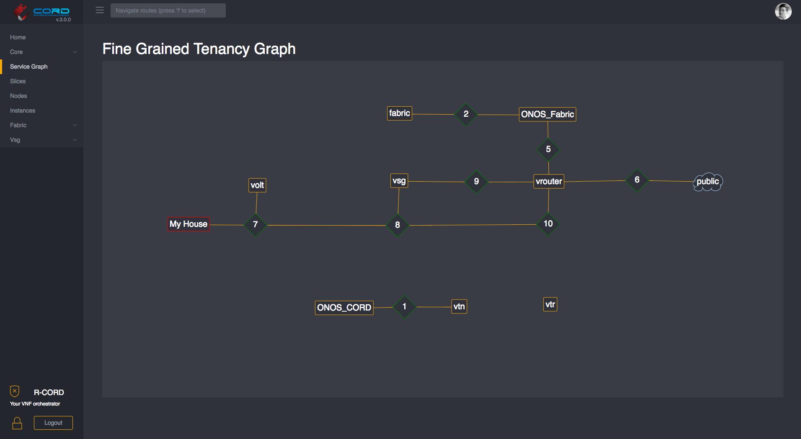

# Installing a Virtual Pod (CORD-in-a-Box)

This guide walks through the steps to bring up a simplified virtual CORD POD,
running in multiple virtual machines on a single physical server.  For
instructions on setting up a full physical pod with multiple servers, please
see [Install a Physical Pod](install_physical.md).

The virtual pod is also known as *CORD-in-a-Box* (or just *CiaB*).  The purpose
of this virtual POD is to enable those interested in understanding how CORD
works to examine and interact with a running CORD environment. There is also a
[Development Workflow: Virtual Pod](xos/dev/workflow_pod.md) that allows for a
tighter loop when developing the XOS core or services.

## What you need (prerequisites)

You will need a *target server*, which will run both a build environment
in a Vagrant VM (used to deploy CORD) as well as CiaB itself.

### Target server requirements

* 64-bit AMD64/x86-64 server, with:
  * 48GB+ RAM
  * 12+ CPU cores
  * 200GB+ disk
* Access to the Internet (no enterprise proxies)
* Ubuntu 14.04.5 LTS freshly installed with updates
* User account used to install CORD-in-a-Box has password-less *sudo*
  capability (e.g., like the `ubuntu` user)

### Target server on CloudLab (optional)

If you do not have a target server available that meets the above requirements,
you can borrow one on [CloudLab](https://www.cloudlab.us).  Sign up for an
account using your organization's email address and choose "Join Existing
Project"; for "Project Name" enter `cord-testdrive`.

> NOTE: CloudLab is supporting CORD as a courtesy.  It is expected that you
> will not use CloudLab resources for purposes other than evaluating CORD.  If,
> after a week or two, you wish to continue using CloudLab to experiment with
> or develop CORD, then you must apply for your own separate CloudLab project.

Once your account is approved, start an experiment using the
`OnePC-Ubuntu14.04.5` profile on the Wisconsin, Clemson, or Utah clusters.
This will provide you with a temporary target server meeting the above
requirements.

Refer to the [CloudLab documentation](http://docs.cloudlab.us) for more
information.

## Building CiaB

There are a few steps to building CiaB:

* Bootstrap the server by installing software dependencies and checking out the
  CORD code
* (Optional) Customize the source and configuration if desired
* Run `make` targets to build and deploy the CORD software
* (Optional) Run end-to-end tests to verify CiaB functionality

> NOTE: If you are connecting to a remote target server, it is highly
> recommended that you run the commands in a `tmux` session on the target
> server, or use `mosh` to connect to the target rather than `ssh`.  Without
> one of these, interrupted connectivity between your local machine and the
> remote server during a build may cause the CiaB installation to hang.

### Bootstrap the server

See [Configuring your Development Environment:cord-bootstrap.sh script
](install.md#cord-bootstrapsh-script) for instructions for running the
bootstrap script to download the CORD source tree and optionally downloading
patches from Gerrit. You must specify the `-v` option to this script in order
to install Vagrant, which is required to build a CiaB.

### (Optional) Customize your build

You can now modify your CORD source tree that has been checked out in `~/cord`,
if required, or [download patches manually from gerrit using
  repo](getting_the_code.md#download-patchsets).

### Build and deploy the software

Once the system has been bootstrapped, run the following `make` commands to
launch the build:

```
cd ~/cord/build
make PODCONFIG=rcord-virtual.yml config
make -j4 build |& tee ~/build.out
```

The output of the build will be displayed, as well as saved in `~/build.out`.
Also logs for individual steps of the build are stored in `~/cord/build/logs`.

The `make -j4 build` step takes a *long time* (at least 1 hour) to run.  Be
patient - if it hasn't completely failed yet, then assume all is well!

### (Optional) Run End-to-End (E2E) tests

If the build completed without errors, you can use the following command to run
basic end-to-end tests:

```
cd ~/cord/build
make pod-test
```

The output of the tests will be displayed, as well as stored in
`~/cord/build/logs/<iso8601_datetime>_pod-test`.

## Inspecting CiaB

CiaB creates a virtual CORD POD running inside Vagrant VMs, using libvirt as a
backend. You can inspect the status of the VM's by setting the `VAGRANT_CWD`
environmental variable to `~/cord/build/scenarios/cord` and running `vagrant
status`:

```
~$ cd cord/build
~/cord/build$ export VAGRANT_CWD=~/cord/build/scenarios/cord
~/cord/build$ vagrant status
Current machine states:

corddev                   running (libvirt)
head1                     running (libvirt)
compute1                  running (libvirt)
compute2                  not created (libvirt)
compute3                  not created (libvirt)

This environment represents multiple VMs. The VMs are all listed
above with their current state. For more information about a specific
VM, run `vagrant status NAME`.
```

### corddev VM

The `corddev` VM is a build machine used to drive the installation.  It
downloads and builds Docker containers and publishes them to the virtual head
node (see below). It then installs MAAS on the virtual head node (for
bare-metal provisioning) and the ONOS, XOS, and OpenStack services in
containers.  This VM can be entered as follows:

```
$ ssh corddev
```

The CORD source tree is mounted at `/opt/cord` inside this VM.

### head1 VM

The `head1` VM is the virtual head node of the POD.  It runs the OpenStack,
ONOS, and XOS services inside containers.  It also simulates a subscriber
devices using a container.  To enter it, simply type:

```
$ ssh head1
```

Inside the VM, a number of services run in Docker and LXD containers.

```
vagrant@head1:~$ docker ps --format "table {{.ID}}\t{{.Names}}\t{{.Image}}"
CONTAINER ID        NAMES                                 IMAGE
84c09b156774        rcord_xos_gui_1                       docker-registry:5000/xosproject/xos-gui:candidate
52e477e9b188        rcord_xos_ws_1                        docker-registry:5000/xosproject/xos-ws:candidate
10a54a4a4f03        rcord_xos_chameleon_1                 docker-registry:5000/xosproject/chameleon:candidate
257f4c29967d        rcord_xos_tosca_1                     docker-registry:5000/xosproject/xos-tosca:candidate
b2c78cf4de7b        rcord_xos_ui_1                        docker-registry:5000/xosproject/xos-ui:candidate
526a4282610d        rcord_xos_core_1                      docker-registry:5000/xosproject/xos-ui:candidate
0783438bba1e        rcord_vtr-synchronizer_1              docker-registry:5000/xosproject/vtr-synchronizer:candidate
e66bd071bdba        rcord_vsg-synchronizer_1              docker-registry:5000/xosproject/vsg-synchronizer:candidate
961ce2793217        rcord_onos-synchronizer_1             docker-registry:5000/xosproject/onos-synchronizer:candidate
7d4b66291c37        rcord_exampleservice-synchronizer_1   docker-registry:5000/xosproject/exampleservice-synchronizer:candidate
a918b5dc6f72        rcord_volt-synchronizer_1             docker-registry:5000/xosproject/volt-synchronizer:candidate
6bc841f6c888        rcord_vrouter-synchronizer_1          docker-registry:5000/xosproject/vrouter-synchronizer:candidate
c99b203f5a7e        rcord_vtn-synchronizer_1              docker-registry:5000/xosproject/vtn-synchronizer:candidate
6fef0cffae83        rcord_openstack-synchronizer_1        docker-registry:5000/xosproject/openstack-synchronizer:candidate
26f8cd2e32df        rcord_fabric-synchronizer_1           docker-registry:5000/xosproject/fabric-synchronizer:candidate
d99b09ec8e2c        rcord_xos_db_1                        docker-registry:5000/xosproject/xos-postgres:candidate
2a22f4836172        rcord_xos_redis_1                     docker-registry:5000/redis:candidate
392e6e4aa4cf        rcord_registrator_1                   docker-registry:5000/gliderlabs/registrator:candidate
1899d7d561f9        rcord_consul_1                        docker-registry:5000/gliderlabs/consul-server:candidate
ba4e6640a4f0        onosfabric_xos-onos_1                 docker-registry:5000/onosproject/onos:candidate
35517eec96e1        onoscord_xos-onos_1                   xos/onos:candidate
b591fd1c406f        mavenrepo                             docker-registry:5000/opencord/mavenrepo:candidate
c4a772babeb6        switchq                               docker-registry:5000/opencord/maas-switchq:candidate
c79f358d03c9        automation                            docker-registry:5000/opencord/maas-automation:candidate
c02fd40982f6        provisioner                           docker-registry:5000/opencord/maas-provisioner:candidate
9b4b481bf2f5        allocator                             docker-registry:5000/opencord/maas-allocator:candidate
2276a0f258ad        generator                             docker-registry:5000/opencord/maas-generator:candidate
bec8d53ebe12        storage                               docker-registry:5000/consul:candidate
4475dddba35a        harvester                             docker-registry:5000/opencord/maas-harvester:candidate
30d4996337bd        registry                              registry:2.4.0
21289d8b63ff        registry-mirror                       registry:2.4.0
```

The above shows Docker containers launched by XOS (container names starting
with `rcord`).  Containers starting with `onos` are running ONOS.  There is
also a Docker image registry, a Maven repository containing the CORD ONOS apps,
and a number of microservices used in bare-metal provisioning.

```
vagrant@head1:~$ sudo lxc list
+-------------------------+---------+------------------------------+------+------------+-----------+
|          NAME           |  STATE  |             IPV4             | IPV6 |    TYPE    | SNAPSHOTS |
+-------------------------+---------+------------------------------+------+------------+-----------+
| ceilometer-1            | RUNNING | 10.1.0.4 (eth0)              |      | PERSISTENT | 0         |
+-------------------------+---------+------------------------------+------+------------+-----------+
| glance-1                | RUNNING | 10.1.0.5 (eth0)              |      | PERSISTENT | 0         |
+-------------------------+---------+------------------------------+------+------------+-----------+
| juju-1                  | RUNNING | 10.1.0.3 (eth0)              |      | PERSISTENT | 0         |
+-------------------------+---------+------------------------------+------+------------+-----------+
| keystone-1              | RUNNING | 10.1.0.6 (eth0)              |      | PERSISTENT | 0         |
+-------------------------+---------+------------------------------+------+------------+-----------+
| mongodb-1               | RUNNING | 10.1.0.13 (eth0)             |      | PERSISTENT | 0         |
+-------------------------+---------+------------------------------+------+------------+-----------+
| nagios-1                | RUNNING | 10.1.0.8 (eth0)              |      | PERSISTENT | 0         |
+-------------------------+---------+------------------------------+------+------------+-----------+
| neutron-api-1           | RUNNING | 10.1.0.9 (eth0)              |      | PERSISTENT | 0         |
+-------------------------+---------+------------------------------+------+------------+-----------+
| nova-cloud-controller-1 | RUNNING | 10.1.0.10 (eth0)             |      | PERSISTENT | 0         |
+-------------------------+---------+------------------------------+------+------------+-----------+
| openstack-dashboard-1   | RUNNING | 10.1.0.11 (eth0)             |      | PERSISTENT | 0         |
+-------------------------+---------+------------------------------+------+------------+-----------+
| percona-cluster-1       | RUNNING | 10.1.0.7 (eth0)              |      | PERSISTENT | 0         |
+-------------------------+---------+------------------------------+------+------------+-----------+
| rabbitmq-server-1       | RUNNING | 10.1.0.12 (eth0)             |      | PERSISTENT | 0         |
+-------------------------+---------+------------------------------+------+------------+-----------+
| testclient              | RUNNING | 192.168.0.244 (eth0.222.111) |      | PERSISTENT | 0         |
+-------------------------+---------+------------------------------+------+------------+-----------+
```

The LXD containers ending with names ending with `-1` are running
OpenStack-related services. These containers can be
entered as follows:

```
$ ssh ubuntu@<container-name>
```

The `testclient` container runs the simulated subscriber device used
for running simple end-to-end connectivity tests. Its only connectivity is
to the vSG, but it can be entered using:

```
$ sudo lxc exec testclient bash
```

### compute1 VM

The `compute1` VM is the virtual compute node controlled by OpenStack.
This VM can be entered from the `head1` VM.  Run `cord prov list` to get the
node name (assigned by MAAS).  The node name will be something like
`bony-alley.cord.lab`; in this case, to login you'd run:

```
$ ssh ubuntu@bony-alley.cord.lab
```

Virtual machines created via XOS/OpenStack will be instantiated on this
compute node.  To login to an OpenStack VM, first get the management IP
address (172.27.0.x):

```
vagrant@head1:~$ source /opt/cord_profile/admin-openrc.sh
vagrant@head1:~$ nova list --all-tenants
+--------------------------------------+-------------------------+--------+------------+-------------+---------------------------------------------------+
| ID                                   | Name                    | Status | Task State | Power State | Networks                                          |
+--------------------------------------+-------------------------+--------+------------+-------------+---------------------------------------------------+
| 3ba837a0-81ff-47b5-8f03-020175eed6b3 | mysite_exampleservice-2 | ACTIVE | -          | Running     | management=172.27.0.3; public=10.6.1.194          |
| 549ffc1e-c454-4ef8-9df7-b02ab692eb36 | mysite_vsg-1            | ACTIVE | -          | Running     | management=172.27.0.2; mysite_vsg-access=10.0.2.2 |
+--------------------------------------+-------------------------+--------+------------+-------------+---------------------------------------------------+
```

The VM hosting the vSG is called `mysite_vsg-1` and we see it has a management
IP of 172.27.0.2.  Then run `ssh-agent` and add the default key (used to access
the OpenStack VMs):

```
vagrant@head1:~$ ssh-agent bash
vagrant@head1:~$ ssh-add
```

SSH to the compute node with the `-A` option and then to the VM using the
management IP obtained above.  So if the compute node name is
`bony-alley.cord.lab` and the management IP is 172.27.0.2:

```
vagrant@head1:~$ ssh -A ubuntu@bony-alley.cord.lab
ubuntu@bony-alley:~$ ssh ubuntu@172.27.0.2

# Now you're inside the mysite-vsg-1 VM
ubuntu@mysite-vsg-1:~$
```


### MAAS GUI

You can access the MAAS (Metal-as-a-Service) GUI by pointing your browser to
the URL `http://<target-server>:8080/MAAS/`.  E.g., if you are running on
CloudLab, your `<target-server>` is the hostname of your CloudLab node.  The
username is `cord` and the auto-generated password is found in
`~/cord/build/maas/passwords/maas_user.txt` on the CiaB server.  For more
information on MAAS, see [the MAAS documentation](http://maas.io/docs).

### XOS GUI

You can access the XOS GUI by pointing your browser to URL
`http://<target-server>:8080/xos/`.  The username is `xosadmin@opencord.org`
and the auto-generated password is found in
`/opt/credentials/xosadmin@opencord.org` on the head node.

The state of the system is that all CORD services have been onboarded to XOS.
You can see them in the `Service Graph` represented in the `Home` page.  If you
want to see more details about the services you navigate to `Core > Services`,
or searching for `Service` in the top bar (you start searching just pressing
`f`)

A sample CORD subscriber has also been created. You can see the `Service Graph`
for subscribers by selecting the `Service Graph` item in the left navigation.

Here is a sample output:


> NOTE: the `Service Graph` will need to be detangled and can be organized by
> dragging the nodes.

### Kibana Logging GUI

The Kibana web interface to the ElasticStack log aggregation system can be
found at: `http://<target-server>:8080/kibana/`.

On initial login, you will be asked to create an index for the `logstash-*`
files - do this and then access the main logging interface under `Discover`.
More information on using Kibana can be be found [in its
documentation](https://www.elastic.co/guide/en/kibana/current/index.html).

## Test Results

After CORD-in-a-Box was set up, a couple of basic health
tests were executed on the platform.  The results of these tests can be
found near the end of `~/build.out`.

### test-vsg

This tests the E2E connectivity of the POD by performing the following steps:

 * Sets up a sample CORD subscriber in XOS
 * Launches a vSG for that subscriber on the CORD POD
 * Creates a test client, corresponding to a device in the subscriber's
   household
 * Connects the test client to the vSG using a simulated OLT
 * Runs `ping` in the client to a public IP address in the Internet

Success means that traffic is flowing between the subscriber household and the
Internet via the vSG.  If it succeeded, you should see some lines like these in
the output:

```
TASK [test-vsg : Output from ping test] ****************************************
Thursday 27 October 2016  15:29:17 +0000 (0:00:03.144)       0:19:21.336 ******
ok: [10.100.198.201] => {
    "pingtest.stdout_lines": [
        "PING 8.8.8.8 (8.8.8.8) 56(84) bytes of data.",
        "64 bytes from 8.8.8.8: icmp_seq=1 ttl=47 time=29.7 ms",
        "64 bytes from 8.8.8.8: icmp_seq=2 ttl=47 time=29.2 ms",
        "64 bytes from 8.8.8.8: icmp_seq=3 ttl=47 time=29.1 ms",
        "",
        "--- 8.8.8.8 ping statistics ---",
        "3 packets transmitted, 3 received, 0% packet loss, time 2003ms",
        "rtt min/avg/max/mdev = 29.176/29.367/29.711/0.243 ms"
    ]
}
```

### test-exampleservice

This test builds on `test-vsg` by loading the *exampleservice* described in the
[Developing for Cord:ExampleService](xos/example_service.md).  The purpose of
the *exampleservice* is to demonstrate how new subscriber-facing services can
be easily deployed to a CORD POD. This test performs the following steps:

 * On-boards *exampleservice* into the CORD POD
 * Creates an *exampleservice* tenant, which causes a VM to be created and
   Apache to be loaded and configured inside
 * Runs a `curl` from the subscriber test client, through the vSG, to the
   Apache server.

Success means that the Apache server launched by the *exampleservice* tenant is
fully configured and is reachable from the subscriber client via the vSG.  If
it succeeded, you should see the following lines near the end the `make
pod-test` output:

```
TASK [test-exampleservice : Output from curl test] *****************************
Thursday 27 October 2016  15:34:40 +0000 (0:00:01.116)       0:24:44.732 ******
ok: [10.100.198.201] => {
    "curltest.stdout_lines": [
        "",
        "",
        "",
        "ExampleService",
        " Service Message: \"hello\"",
        " Tenant Message: \"world\""
    ]
}
```

## Troubleshooting

If the CiaB build fails, you may try simply resuming the build at the place
that failed.  The easiest way is to do is to re-run the `make build` command.
It will skip over the steps that have already completed.

If you need to force `make build` to re-run steps that have already completed,
remove the appropriate file in the `milestones` directory prior to re-running.

For more information about how the build works, see [Troubleshooting and Build
Internals](troubleshooting.md).


## Congratulations!

If you got this far, you successfully built, deployed, and tested your first
(virtual) CORD POD.

You are now ready to bring up a multi-node POD with a real switching fabric and
multiple physical compute nodes.  The process for doing so is described in
[Installing a Physical POD](install_physical.md).

