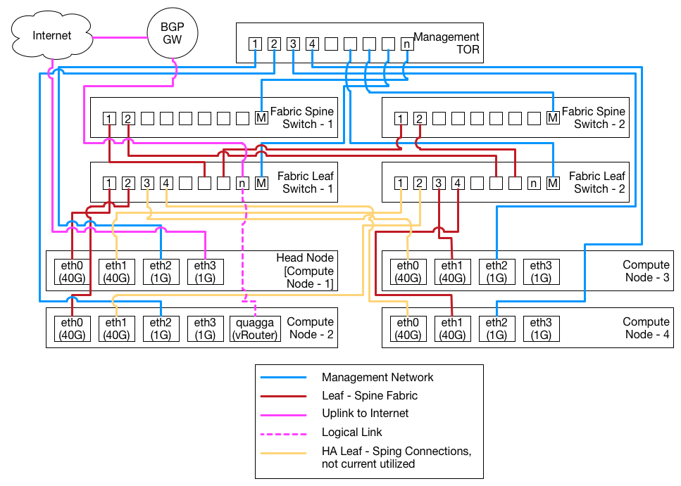

# CORD Quick Start Guide using Physical Nodes

This guide is meant to enable the user to utilize the artifacts of this
repository to to deploy CORD on to a physical hardware rack. The artifacts in
this repository will deploy CORD against a standard physical rack wired
according to the **best practices** as defined in this document.

**NOTE:** *If you are new to CORD, you should start by bringing up a development
POD on a single physical server to get familiar with the CORD deployment
process.  Instructions to do so are in [quickstart.md](./quickstart.md).*

## Physical configuration


As depicted in the diagram above the base model for the CORD POD deployment
contains:
- 4 OF switches comprising the leaf - spine fabric utilized for data traffic
- 4 compute nodes with with 2 40G ports and 2 1G ports
- 1 top of rack (TOR) switch utilized for management communications

The best practices in terms of connecting the components of the CORD POD
include:
- Leaf nodes are connected to the spines nodes starting at the highest port
number on the leaf.
- For a given leaf node, its connection to the spine nodes terminate on the
same port number on each spine.
- Leaf *n* connections to spine nodes terminate at port *n* on each spine
node.
- Leaf spine switches are connected into the management TOR starting from the
highest port number.
- Compute nodes fabric interfaces (typically 40G or 10G) are named *eth0* and *eth1*.
- Compute nodes POD management interfaces (typically 1G) are named *eth2* and *eth3*.
- Compute node *n* is connected to the management TOR switch on port *n*,
egressing from the compute node at *eth2*.
- Compute node *n* is connected to its primary leaf, egressing at *eth0* and terminating on the leaf at port *n*.
- Compute node *n* is connected to its secondary leaf, egressing at *eth1* and
terminating on the leaf at port *n*.
- *eth3* on the head node is the uplink from the POD to the Internet.

The following assumptions are made about the phyical CORD POD being deployed:
- The leaf - spine switchs are Accton 6712s
- The compute nodes are using 40G Intel NIC cards
- The compute node that is to be designated the *head node* has
**Ubuntu 14.04 LTS** installed. In addition, the user should have **password-less sudo permission**.

**Prerequisite: Vagrant is installed and operationally.**
**Note:** *This quick start guide has only been tested against Vagrant and
VirtualBox, specially on MacOS.*

## Bootstrap the Head Node
The head node is the key to the physical deployment of a CORD POD. The
automated deployment of the physical POD is designed such that the head node is
manually deployed, with the aid of automation tools, such as Ansible and from
this head node the rest of the POD deployment is automated.

The head node is deployed from a host outside the CORD POD (OtP).

## Install Repo

Make sure you have a bin directory in your home directory and that it is included in your path:

```
mkdir ~/bin
PATH=~/bin:$PATH
```

(of course you can put repo wherever you want)

Download the Repo tool and ensure that it is executable:

```
curl https://storage.googleapis.com/git-repo-downloads/repo > ~/bin/repo
chmod a+x ~/bin/repo
```

## Clone the Repository
To clone the repository, on your OtP build host issue the `git` command:
```
mkdir opencord && cd opencord
repo init -u https://gerrit.opencord.org/manifest -b master
```

Fetch the opencord source code
```
repo sync
```

### Complete
When this is complete, a listing (`ls`) of this directory should yield output
similar to:
```
ls -F
build/         incubator/     onos-apps/     orchestration/ test/
```
## Create the Development Machine

The development environment is required for the tasks in this repository.
This environment leverages [Vagrant](https://www.vagrantup.com/docs/getting-started/)
to install the tools required to build and deploy the CORD software.

To create the development machine the following  Vagrant command can be
used. This will create an Ubuntu 14.04 LTS based virtual machine and install
some basic required packages, such as Docker, Docker Compose, and
Oracle Java 8.
```
cd build
vagrant up corddev
```
**NOTE:** *The VM will consume 2G RAM and about 12G disk space. Make sure it can obtain sufficient resources.
It may takes several minutes for the first command `vagrant up
corddev` to complete as it will include creating the VM as well as downloading
and installing various software packages.*

### Complete

Once the Vagrant VM is created and provisioned, you will see output ending
with:
```
==> corddev: PLAY RECAP *********************************************************************
==> corddev: localhost                  : ok=29   changed=25   unreachable=0    failed=0
```
The important thing is that the *unreachable* and *failed* counts are both zero.

## Connect to the Development Machine
To connect to the development machine the following vagrant command can be used.
```
vagrant ssh corddev
```

Once connected to the Vagrant machine, you can find the deployment artifacts
in the `/cord` directory on the VM.
```
cd /cord/build
```

### Gradle
[Gradle](https://gradle.org/) is the build tool that is used to help
orchestrate the build and deployment of a POD. A *launch* script is included
in the Vagrant machine that will automatically download and install `gradle`.
The script is called `gradlew` and the download / install will be invoked on
the first use of this script; thus the first use may take a little longer
than subsequent invocations and requires a connection to the internet.

### Complete
Once you have created and connected to the development environment this task is
complete. The `cord` repository files can be found on the development machine
under `/cord`. This directory is mounted from the host machine so changes
made to files in this directory will be reflected on the host machine and
vice-versa.


## Fetch
The fetching phase of the deployment pulls Docker images from the public
repository down to the local machine as well as clones any `git` submodules
that are part of the project. This phase can be initiated with the following
command:
```
./gradlew fetch
```

### Complete
Once the fetch command has successfully been run, this step is complete. After
this command completes you should be able to see the Docker images that were
downloaded using the `docker images` command on the development machine:
```
docker images
REPOSITORY                  TAG                 IMAGE ID            CREATED             SIZE
python                      2.7-alpine          9c8c07c0f9b7        3 weeks ago         72.22 MB
xosproject/xos-base         <none>              955e6dcdcf36        4 weeks ago         686.1 MB
redis                       <none>              74b99a81add5        6 weeks ago         182.8 MB
xosproject/xos-postgres     <none>              95312a611414        6 weeks ago         393.8 MB
xosproject/cord-app-build   <none>              003a1c20e34a        3 months ago        1.108 GB
onosproject/onos            <none>              309088c647cf        5 months ago        825.6 MB
consul                      <none>              62f109a3299c        5 months ago        41.05 MB
swarm                       <none>              47dc182ea74b        7 months ago        19.32 MB
nginx                       <none>              3c69047c6034        7 months ago        182.7 MB
xosproject/vsg              <none>              dd026689aff3        8 months ago        336 MB
```

## Build Images
Bare metal provisioning leverages utilities built and packaged as Docker
container images. These utilities are:

   - cord-maas-bootstrap - (directory: `bootstrap`) run at MAAS installation
   time to customize the MAAS instance via REST interfaces
   - cord-maas-automation - (directory: `automation`) daemon on the head node to
   automate PXE booted servers through the MAAS bare metal deployment work flow
   - cord-maas-switchq - (directory: `switchq`) daemon on the head
   node that watches for new switches being added to the POD and triggers
   provisioning when a switch is identified (via the OUI on MAC address).
   - cord-maas-provisioner - (directory: `provisioner`) daemon on the head node
   to managing the execution of ansible playbooks against switches and compute
   nodes as they are added to the POD.
   - cord-ip-allocator - (directr: `ip-allocator`) daemon on the head node used
   to allocate IP address for the fabric interfaces.
   - cord-dhcp-harvester - (directory: `harvester`) run on the head node to
   facilitate CORD / DHCP / DNS integration so that all hosts can be resolved
   via DNS
   - opencord/mavenrepo
   - cord-test/nose
   - cord-test/quagga
   - cord-test/radius
   - onosproject/onos

The images can be built by using the following command. This will build all
the images.
```
./gradlew buildImages
```

**NOTE:** *The first time you run `./gradlew` it will download from the Internet
the `gradle` binary and install it locally. This is a one time operation.*

### Complete
Once the `buildImages` command successfully runs this task is complete. The
CORD artifacts have been built and the Docker images can be viewed by using the
`docker images` command on the development machine.
```
docker images --format 'table {{.Repository}}\t{{.Tag}}\t{{.Size}}\t{{.ID}}'
REPOSITORY                  TAG                 SIZE                IMAGE ID
opencord/mavenrepo          latest              324 MB              206959c84d14
cord-maas-switchq           latest              338.2 MB            a04b43800cc7
cord-provisioner            latest              820.9 MB            708734f3691b
cord-dhcp-harvester         latest              347.1 MB            77aaa029699b
config-generator            latest              279 MB              3862c0872ce6
cord-maas-bootstrap         latest              359.4 MB            5cebf664dfc1
cord-maas-automation        latest              371.1 MB            a7872c54866e
cord-ip-allocator           latest              277.1 MB            4c39faeaf29a
golang                      alpine              241.1 MB            016944b25311
golang                      1.6-alpine          283.6 MB            2b545aa749b4
ubuntu                      14.04               187.9 MB            aae2b63c4946
nginx                       latest              181.5 MB            abf312888d13
python                      2.7-alpine          72.22 MB            9c8c07c0f9b7
xosproject/xos-base         <none>              686.1 MB            955e6dcdcf36
redis                       <none>              182.8 MB            74b99a81add5
xosproject/xos-postgres     <none>              393.8 MB            95312a611414
xosproject/cord-app-build   <none>              1.108 GB            003a1c20e34a
onosproject/onos            <none>              825.6 MB            309088c647cf
consul                      <none>              41.05 MB            62f109a3299c
swarm                       <none>              19.32 MB            47dc182ea74b
nginx                       <none>              182.7 MB            3c69047c6034
xosproject/vsg              <none>              336 MB              dd026689aff3
```

**NOTE:** *Not all the above Docker images were built by the `buildImages`
command. Some of them, list golang, are used as a base for other Docker
images; and some, like `abh1nav/dockerui` were downloaded when the development
machine was created with `vagrant up`.*

## Deployment Configuration File
The commands to deploy the POD can be customized via a *deployment configuration
file*. The file is in [YAML](http://yaml.org/).

To construct a configuration file for yoru physical POD you should copy the
sample deployment configuration found in `config/sample.yml` and modify the
values to fit your physical deployment.

## Publish
Publishing consists of *pushing* the build docker images to the Docker
repository on the target head node. This step can take a while as it has to
transfer all the image from the development machine to the target head node.
This step is started with the following command:
```
./gradlew -PdeployConfig=config/podX.yml -PtargetReg=<head-node-ip-address>:5000 publish
```

### Complete

Once the `publish` command successfully runs this task is complete. When this
step is complete a Docker registry and Docker registry mirror. It can be
verified that these are running by using the `docker ps` command.
```
docker ps -a --format 'table {{.ID}}\t{{.Image}}\t{{.Command}}\t{{.CreatedAt}}'
CONTAINER ID        IMAGE               COMMAND                  CREATED AT
5f1cbebe7e61        registry:2.4.0      "/bin/registry serve "   2016-07-13 17:03:08 +0000 UTC
6d3a911e5323        registry:2.4.0      "/bin/registry serve "   2016-07-13 17:03:08 +0000 UTC
```

We can also query the docker registry on the head node. We should be able to
observe a list of docker images.

_Note: the example below uses the command `jq`
to pretty print JSON. If you system doesn't have `jq` installed it can be
installed using `sudo apt-get install -y jq`._

```
curl -sS http://head-node-ip-address:5000/v2/_catalog | jq .`
{
  "repositories": [
    "config-generator",
    "consul",
    "cord-dhcp-harvester",
    "cord-ip-allocator",
    "cord-maas-automation",
    "cord-maas-bootstrap",
    "cord-maas-switchq",
    "cord-provisioner",
    "mavenrepo",
    "nginx",
    "onosproject/onos",
    "redis",
    "swarm",
    "xosproject/cord-app-build",
    "xosproject/vsg",
    "xosproject/xos-base",
    "xosproject/xos-postgres"
  ]
}
```

## Deploy Bare Metal Provisioning Capabilities
There are three parts to deploying bare metal: deploying the head node PXE
server (`MAAS`), PXE booting a compute node, and post deployment provisioning
of the compute node. These tasks are accomplished utilizing additionally
Vagrant machines as well as executing `gradle` tasks in the Vagrant
development machine. This task also provisions XOS. XOS provides service
provisioning and orchestration for the CORD POD.

### Deploy MAAS and XOS
Canonical MAAS provides the PXE and other bare metal provisioning services for
CORD and will be deployed on the head node.
```
./gradlew -PdeployConfig=config/podX.yml deploy
```

This task can take some time so be patient. It should complete without errors,
so if an error is encountered, something has gone Horribly Wrong (tm).  See the
[Getting Help](#getting-help) section.

### Complete

This step is complete when the command successfully runs. The Web UI for MAAS
can be viewed by browsing to the target machine using a URL of the form
`http://head-node-ip-address:5240/MAAS`. To login to the web page, use `cord`
for username. If you have set a password in the deployment configuration
password use that, else the password used can be found in your build directory
under `<base>/build/maas/passwords/maas_user.txt`.

After the `deployBase` command install `MAAS`, it initiates the download of
an Ubuntu 14.04 boot image that will be used to boot the other POD servers.
This download can take some time and the process cannot continue until the
download is complete. The status of the download can be verified through
the UI by visiting the URL `http://head-node-ip-address:5240/MAAS/images/`,
or via the command line from head node via the following commands:
```
APIKEY=$(sudo maas-region-admin apikey --user=cord)
maas login cord http://localhost/MAAS/api/1.0 "$APIKEY"
maas cord boot-resources read | jq 'map(select(.type != "Synced"))'
```

It the output of of the above commands is not a empty list, `[]`, then the
images have not yet been completely downloaded. depending on your network speed
this could take several minutes. Please wait and then attempt the last command
again until the returned list is empty, `[]`. When the list is empty you can
proceed.

Browse around the UI and get familiar with MAAS via documentation at `http://maas.io`

The deployment of XOS includes a deployment of Open Stack.

## Booting Compute Nodes

### Network configuration

The CORD POD uses two core network interfaces, `fabric` and `mgmtbr`. The `fabric` interface will be used
to bond all interfaces meant to be used for CORD data traffic and the `mgmtbr` will be used to bridge all
interfaces used for POD management (signalling) traffic.

An additional interface of import on the head node is the external interface, or the interface through which
the management net accesses upstream servers; such as the Ineteret.

How physical interfaces are identified and mapped to either the `fabric` or `mgmtbr` interface is a combination
of their name, NIC driver, and/or bus type.

By default any interface that has a module or kernel driver of `tun`, `bridge`, `bonding`, or `veth` will be
ignored when selecting devices for the `fabric` and `mgmtbr` interfaces. As will any interface that is not
associated with a bus type or has a bus type of `N/A` or `tap`. For your specific deployment you can
verify the interface information using the `ethtool -i <name>` command on the linux prompt.

All other interfaces that are not ignored will be considered for selection to either the `fabric` or
`mbmtbr` interface. By default, any interface that has a module or kernel driver of `i40e` or `mlx4_en` will
be selected to the `fabric` interface and all others will be selected to the `mgmtbr` interface.

As the `fabric` interface is a `bond` the first interface, sorted alpha numberically by name, will be used
as the primary interface.

Currently the `mgmtbr` interface is a bridge and the physical interfaces will be added as `bridge_ports`
on the `mgmtbr`. This is likely to change to a `bond` in a future release and at this time the primary
interface will be selected by alpha numberic sorting.

#### Customizing Network Configuration

The network configuration can be customized to your deployment using a set of variables that can be set
in your deployment configuration file, e.g. `podX.yml`. There is a set of include, exclude, and ignore
variables that operation on the interface name, module type, and bus type. By setting values on these
variables it is fairly easy to customize the network settings.

The options are processed as following:

1. If a given interface matches an ignore option, it is not available to be selected into either the `fabric` or `mgmtbr` interface and will not be modified in the `/etc/network/interface`.
1. If no include criteria are specified and the given interfaces matches then exclude criteria then the interface will be set as `manual` configuraiton in the `/etc/network/interface` file and will not be `auto` activated
1. If no include criteria are specified and the given interface does _NOT_ match the exclude criteria then this interface will be included in either the `frabric` or `mgmtbr` interface
1. If include criteria are specified and the given interface does not match the criteria then the interface will be ignored and its configuration will _NOT_ be modified
1. If include criteria are specified and the given interface matches the criteria then if the given interface also matches the exclude criteria then this interface will be set as `manual` configuraiton in the `/etc/network/interface` file and will not be `auto` activated
1. If include criteria are specified and the given interface matches the criteria and if it does _NOT_ match the exclude criteria then this interface will be included in either the `frabric` or `mgmtbr` interface

By default, the only criteria that are specified is the _fabric include module types_ and they are set to `i40e,mlx4_en` (_NOTE: the list is now comma separated and not vertical bar (`|`) separated._)

If the _fabric include module types_ is specified and the _management exclude module types_ are not specified, then
by default the _fabric include module types_ are used as the _management exclude module types_. This ensures that
by default the `fabric` and the `mgmtbr` do not intersect on interface module types.

If an external interface is specified in the deployment configuration, this interface will be added to the
_farbric_ and _management_ _ignore names_ list.

Each of the criteria is specified as a comma separated list of regular expressions.
Default

To set the variables you can use the `seedServer.extraVars` section in the deployment config file as follows:

```
seedServer:
  extraVars:
    - 'fabric_include_names=<name1>,<name2>'
    - 'fabric_include_module_types=<mod1>,<mod2>'
    - 'fabric_include_bus_types=<bus1>,<bus2>'
    - 'fabric_exclude_names=<name1>,<name2>'
    - 'fabric_exclude_module_types=<mod1>,<mod2>'
    - 'fabric_exclude_bus_types=<bus1>,<bus2>'
    - 'fabric_ignore_names=<name1>,<name2>'
    - 'fabric_ignore_module_types=<mod1>,<mod2>'
    - 'fabric_ignore_bus_types=<bus1>,<bus2>'
    - 'management_include_names=<name1>,<name2>'
    - 'management_include_module_types=<mod1>,<mod2>'
    - 'management_include_bus_types=<bus1>,<bus2>'
    - 'management_exclude_names=<name1>,<name2>'
    - 'management_exclude_module_types=<mod1>,<mod2>'
    - 'management_exclude_bus_types=<bus1>,<bus2>'
    - 'management_ignore_names=<name1>,<name2>'
    - 'management_ignore_module_types=<mod1>,<mod2>'
    - 'management_ignore_bus_types=<bus1>,<bus2>'
```

The Ansible scripts configure MAAS to support DHCP/DNS/PXE on the eth2 and mgmtbr interfaces.

Once it has been verified that the ubuntu boot image has been downloaded the
compute nodes may be PXE booted.

**Note:** *In order to ensure that the compute node PXE boot the bios settings
may have to be adjusted. Additionally, the remote power management on the
compute nodes must be enabled.*

The compute node will boot, register with MAAS, and then be shut off. After this
is complete an entry for the node will be in the MAAS UI at
`http://head-node-ip-address:5240/MAAS/#/nodes`. It will be given a random
hostname, in the Canonical way, of a adjective and an noun, such as
`popular-feast.cord.lab`. *The name will be different for every deployment.* The
new node will be in the `New` state.

As the machines boot they should be automatically transitioned from `New`
through the states of `Commissioning` and `Acquired` to `Deployed`.

### Post Deployment Provisioning of the Compute Node
Once the node is in the `Deployed` state, it will be provisioned for use in a
CORD POD by the execution of an `Ansible` playbook.

### Complete
Once the compute node is in the `Deployed` state and post deployment provisioning on the compute node is
complete, this task is complete.

Logs of the post deployment provisioning of the compute nodes can be found
in `/etc/maas/ansible/logs` on the head node.

Assitionally, the post deployment provisioning of the compute nodes can be
queried using the command `cord prov list`
```
cord prov list
ID                                         NAME                   MAC                IP          STATUS      MESSAGE
node-c22534a2-bd0f-11e6-a36d-2c600ce3c239  steel-ghost.cord.lab   2c:60:0c:cb:00:3c  10.6.0.107  Complete
node-c238ea9c-bd0f-11e6-8206-2c600ce3c239  feline-shirt.cord.lab  2c:60:0c:e3:c4:2e  10.6.0.108  Complete
node-c25713c8-bd0f-11e6-96dd-2c600ce3c239  yellow-plot.cord.lab   2c:60:0c:cb:00:f0  10.6.0.109  Complete
```

The following status values are defined for the provisioning status:
   - `Pending`-  the request has been accepted by the provisioner but not yet
   started
   - `Processing` - the request is being processed and the node is being
   provisioned
   - `Complete` - the provisioning has been completed successfully
   - `Error` - the provisioning has failed and the `message` will be
   populated with the exit message from provisioning.

Please refer to [Re-provision Compute Nodes and Switches
](#re-provision-compute-nodes-and-switches)
if you want to restart this process or re-provision a initialized compute node.

## Booting OpenFlow switches
Once the compute nodes have begun their boot process you may also boot the
switches that support the leaf spine fabric. These switches should ONIE install
boot and download their boot image from MAAS.

### Complete
This step is complete when the command completes successfully. You can verify
the provisioning of the switches by querying the provisioning service
using `cord prov list` which will show the status of the switches as well as
the compute nodes. Switches can be easily identified as their ID will be the
MAC address of the switch management interface.
```
cord prov list
ID                                         NAME                   MAC                IP          STATUS      MESSAGE
cc:37:ab:7c:b7:4c                          spine-1                cc:37:ab:7c:b7:4c  10.6.0.23   Complete
cc:37:ab:7c:ba:58                          leaf-2                 cc:37:ab:7c:ba:58  10.6.0.20   Complete
cc:37:ab:7c:bd:e6                          onl-x86                cc:37:ab:7c:bd:e6  10.6.0.52   Complete
cc:37:ab:7c:bf:6c                          spine-2                cc:37:ab:7c:bf:6c  10.6.0.22   Complete
node-c22534a2-bd0f-11e6-a36d-2c600ce3c239  steel-ghost.cord.lab   2c:60:0c:cb:00:3c  10.6.0.107  Complete
node-c238ea9c-bd0f-11e6-8206-2c600ce3c239  feline-shirt.cord.lab  2c:60:0c:e3:c4:2e  10.6.0.108  Complete
node-c25713c8-bd0f-11e6-96dd-2c600ce3c239  yellow-plot.cord.lab   2c:60:0c:cb:00:f0  10.6.0.109  Complete
```
The following status values are defined for the provisioning status:
   - `Pending`-  the request has been accepted by the provisioner but not yet
   started
   - `Processing` - the request is being processed and the node is being
   provisioned
   - `Complete` - the provisioning has been completed successfully
   - `Error` - the provisioning has failed and the `message` will be
   populated with the exit message from provisioning.

Please refer to [Re-provision Compute Nodes and Switches
](#re-provision-compute-nodes-and-switches)
if you want to restart this process or re-provision a initialized switch.

## Post Deployment Configuration of XOS / ONOS VTN app

The compute node provisioning process described above (under [Booting Compute Nodes](#booting-compute-nodes))
will install the servers as OpenStack compute nodes.  You should be able to see them on the CORD head node
by running the following commands:
```
source ~/admin-openrc.sh
nova hypervisor-list
```

You will see output like the following (showing each of the nodes you have provisioned):

```
+----+-------------------------+
| ID | Hypervisor hostname     |
+----+-------------------------+
| 1  | nova-compute-1.cord.lab |
+----+-------------------------+
```

However, after the compute nodes are provisioned, currently some additional manual configuration is required to set up the ONOS
services in XOS.  We intend to automate this process in the future, but for the time being the following steps must be carried out.

To prepare to run these steps, on the CORD head node, login to the XOS VM and change to the `service-profile/cord-pod` directory:

```
ssh ubuntu@xos
cd service-profile/cord-pod
```

All of the steps listed below are run in this directory.

### Add the Nodes to XOS

To create entries for the newly provisioned nodes in XOS, run the following command:

```
make new-nodes
```

### VTN Configuration

XOS maintains the network configuration of the ONOS VTN app and pushes this configuration to ONOS.  Information
for new nodes must be manually added to XOS.  XOS will generate the VTN network configuration
from this information and push it to ONOS.

A script called `make-vtn-external-yaml.sh` can be used to create a TOSCA template for the VTN
information maintained by XOS.  To run it:

```
rm vtn-external.yaml; make vtn-external.yaml
```

This will generate a TOSCA file called `vtn-external.yaml` that is used to store the network
information required by VTN in XOS.  The information in this TOSCA file closely maps onto the
fields in the [VTN ONOS app's network configuration](https://wiki.opencord.org/display/CORD/Network+Config+Guide).  For
example, in `vtn-external.yaml`, under the
*properties* field of *service#vtn*, you will see fields such as *privateGatewayMac*, *localManagementIp*,
and *ovsdbPort*; these correspond to the fields of the same name in VTN's network configuration.

The `vtn-external.yaml` file is generated with the information that applies to the single-node CORD POD.  You
will need to change the values of some fields in this file for your POD.  For each OpenStack compute
node (e.g., *nova-compute-1.cord.lab*), you will see the following in `vtn-external.yaml`:

```
    nova-compute-1.cord.lab:
      type: tosca.nodes.Node

    # VTN bridgeId field for node nova-compute-1.cord.lab
    nova-compute-1.cord.lab_bridgeId_tag:
      type: tosca.nodes.Tag
      properties:
          name: bridgeId
          value: of:0000000000000001
      requirements:
          - target:
              node: nova-compute-1.cord.lab
              relationship: tosca.relationships.TagsObject
          - service:
              node: service#ONOS_CORD
              relationship: tosca.relationships.MemberOfService

    # VTN dataPlaneIntf field for node nova-compute-1.cord.lab
    nova-compute-1.cord.lab_dataPlaneIntf_tag:
      type: tosca.nodes.Tag
      properties:
          name: dataPlaneIntf
          value: fabric
      requirements:
          - target:
              node: nova-compute-1.cord.lab
              relationship: tosca.relationships.TagsObject
          - service:
              node: service#ONOS_CORD
              relationship: tosca.relationships.MemberOfService

    # VTN dataPlaneIp field for node nova-compute-1.cord.lab
    nova-compute-1.cord.lab_dataPlaneIp_tag:
      type: tosca.nodes.Tag
      properties:
          name: dataPlaneIp
          value: 10.168.0.253/24
      requirements:
          - target:
              node: nova-compute-1.cord.lab
              relationship: tosca.relationships.TagsObject
          - service:
              node: service#ONOS_CORD
              relationship: tosca.relationships.MemberOfService
```

The above YAML stores node-specific fields required by VTN:
   - *bridgeId*: the unique device ID of the integration bridge
   - *dataPlaneIntf*: data network interface
   - *dataPlaneIp*: data network IP of the machine

You will need to edit the above values to reflect the desired configuration for each compute node.  For
more details on the format of VTN's network configuration, see
[the VTN Network Configuration Guide](https://wiki.opencord.org/display/CORD/Network+Config+Guide).

### Fabric Gateway Configuration
To configure the fabric gateway, you will need to edit the file `cord-services.yaml`.
You will see a section that looks like this:

```
    addresses_vsg:
      type: tosca.nodes.AddressPool
      properties:
          addresses: 10.168.0.0/24
          gateway_ip: 10.168.0.1
          gateway_mac: 02:42:0a:a8:00:01
```

Edit this section so that it reflects the fabric's address block assigned to the vSGs, as well
as the gateway IP and MAC address that the vSGs should use to reach the Internet.

### Update Information in XOS

Once the `vtn-external.yaml` and `cord-services.yaml` files have been edited as described above,
push them to XOS by running the following:

```
make vtn
make cord
```

### Complete

This step is complete once you see the new information for the VTN app in XOS and ONOS.

To check the VTN configuration maintained by XOS:
   - Go to the "ONOS apps" page in the CORD GUI:
      - URL: `http://<head-node>/admin/onos/onosapp/`
      - Username: `padmin@vicci.org`
      - Password: `letmein`
   - Select *VTN_ONOS_app* in the table
   - Verfy that the *Backend status text* has a green check with the message *successfully enacted*
   - Select *Attributes* tab
   - Look for the *rest_onos/v1/network/configuration/* attribute.  Verify that its value looks correct for the VTN app's network configuration.

To check that the network configuration has been successfully pushed
to the ONOS VTN app and processed by it:

   - Log into ONOS from the head node
      - Command: `ssh -p 8101 karaf@onos-cord`
      - Password: `karaf`
   - Run the `cordvtn-nodes` command
   - Verify that the information for all nodes is correct
   - Verify that the initialization status of all nodes is *COMPLETE*

This will look like the following:

```
$ ssh -p 8101 karaf@onos-cord
Password authentication
Password: # the password is 'karaf'
Welcome to Open Network Operating System (ONOS)!
     ____  _  ______  ____
    / __ \/ |/ / __ \/ __/
   / /_/ /    / /_/ /\ \
   \____/_/|_/\____/___/

Documentation: wiki.onosproject.org
Tutorials:     tutorials.onosproject.org
Mailing lists: lists.onosproject.org

Come help out! Find out how at: contribute.onosproject.org

Hit '<tab>' for a list of available commands
and '[cmd] --help' for help on a specific command.
Hit '<ctrl-d>' or type 'system:shutdown' or 'logout' to shutdown ONOS.

onos> cordvtn-nodes
hostname=nova-compute-1, hostMgmtIp=192.168.122.140/24, dpIp=10.168.0.253/24, br-int=of:0000000000000001, dpIntf=fabric, init=COMPLETE
Total 1 nodes
```

### Troubleshoot
If the compute node is not initialized properly (i.e. not in the COMPLETE state):
On the compute node, run
```
sudo ovs-vsctl del-br br-int
```
On the head node, run
```
ssh karaf@onos-cord-1 -p 8101
```
(password is karaf)
and then in the ONOS CLI, run
```
cordvtn-node-init <compute-node-name>
```
(name is something like creamy-vegetable)

## Post Deployment Configuration of the ONOS Fabric

### Manully Configure Routes on the Compute Node `br-int` Interface
The routes on the compute node `br-int` interface need to be manually configured now.
Run the following command on compute-1 and compute-2 (nodes in 10.6.1.0/24)
```
sudo ip route add 10.6.2.0/24 via 10.6.1.254
```
Run the following command on compute-3 and compute-4 (nodes in 10.6.2.0/24)
```
sudo ip route add 10.6.1.0/24 via 10.6.2.254
```

### Modify and Apply Fabric Configuration
Configuring the switching fabric for use with CORD is documented in the
[Fabric Configuration Guide](https://wiki.opencord.org/display/CORD/Fabric+Configuration+Guide) on the OpenCORD wiki.

On the head node is a service that will generate an ONOS network configuration
for the leaf/spine network fabric. This configuration is generating by
querying ONOS for the known switches and compute nodes and producing a JSON
structure that can be `POST`ed to ONOS to implement the fabric.

The configuration generator can be invoked using the `cord generate` command.
The configuration will be generated to `stdout`.

Before generating a configuration you need to make sure that the instance of
ONOS controlling the fabric doesn't contain any stale data and has has processed
a packet from each of the switches and computes nodes. ONOS needs to process a
packet because it does not have a mechanism to discover the network, thus to be
aware of a device on the network ONOS needs to first receive a packet from it.

To remove stale data from ONOS, the ONOS CLI `wipe-out` command can be used:
```
ssh -p 8101 karaf@onos-fabric wipe-out -r -j please
Warning: Permanently added '[onos-fabric]:8101,[10.6.0.1]:8101' (RSA) to the list of known hosts.
Password authentication
Password:
Wiping intents
Wiping hosts
Wiping Flows
Wiping groups
Wiping devices
Wiping links
Wiping UI layouts
Wiping regions
```

To ensure ONOS is aware of all the switches and the compute nodes, you must
have each switch "connect" to the controller and have each compute node ping
over its fabric interface to the controller.

If the switches are not already connected the following commands will initiate
a connection.

```shell
for s in $(cord switch list | grep -v IP | awk '{print $3}'); do
ssh -qftn root@$s ./connect -bg 2>&1  > $s.log
done
```

You can verify ONOS has recognized the devices using the following command:

```shell
ssh -p 8101 karaf@onos-fabric devices
Warning: Permanently added '[onos-fabric]:8101,[10.6.0.1]:8101' (RSA) to the list of known hosts.
Password authentication
Password:
id=of:0000cc37ab7cb74c, available=true, role=MASTER, type=SWITCH, mfr=Broadcom Corp., hw=OF-DPA 2.0, sw=OF-DPA 2.0, serial=, driver=ofdpa, channelId=10.6.0.23:58739, managementAddress=10.6.0.23, protocol=OF_13
id=of:0000cc37ab7cba58, available=true, role=MASTER, type=SWITCH, mfr=Broadcom Corp., hw=OF-DPA 2.0, sw=OF-DPA 2.0, serial=, driver=ofdpa, channelId=10.6.0.20:33326, managementAddress=10.6.0.20, protocol=OF_13
id=of:0000cc37ab7cbde6, available=true, role=MASTER, type=SWITCH, mfr=Broadcom Corp., hw=OF-DPA 2.0, sw=OF-DPA 2.0, serial=, driver=ofdpa, channelId=10.6.0.52:37009, managementAddress=10.6.0.52, protocol=OF_13
id=of:0000cc37ab7cbf6c, available=true, role=MASTER, type=SWITCH, mfr=Broadcom Corp., hw=OF-DPA 2.0, sw=OF-DPA 2.0, serial=, driver=ofdpa, channelId=10.6.0.22:44136, managementAddress=10.6.0.22, protocol=OF_13
```

To make sure that ONOS is aware of the compute nodes the follow command will
a ping over the fabric interface on each of the compute nodes.

```shell
for h in localhost $(cord prov list | grep "^node" | awk '{print $4}'); do
ssh -qftn $h ping -c 1 -I fabric 8.8.8.8;
done
```

You can verify ONOS has recognized the devices using the following command:
```shell
ssh -p 8101 karaf@onos-fabric hosts
Warning: Permanently added '[onos-fabric]:8101,[10.6.0.1]:8101' (RSA) to the list of known hosts.
Password authentication
Password:
id=00:16:3E:DF:89:0E/None, mac=00:16:3E:DF:89:0E, location=of:0000cc37ab7cba58/3, vlan=None, ip(s)=[10.6.0.54], configured=false
id=3C:FD:FE:9E:94:28/None, mac=3C:FD:FE:9E:94:28, location=of:0000cc37ab7cba58/4, vlan=None, ip(s)=[10.6.0.53], configured=false
id=3C:FD:FE:9E:94:30/None, mac=3C:FD:FE:9E:94:30, location=of:0000cc37ab7cbde6/1, vlan=None, ip(s)=[10.6.1.1], configured=false
id=3C:FD:FE:9E:98:69/None, mac=3C:FD:FE:9E:98:69, location=of:0000cc37ab7cbde6/2, vlan=None, ip(s)=[10.6.0.5], configured=false
```

To modify the fabric configuration for your environment, on the head node,
generate a new network configuration using the following commands:

```
cp ~/xos_services/fabric/config/network-cfg-quickstart.json{,.$(date +%Y%m%d-%H%M%S)}
cord generate > ~/xos_services/fabric/config/network-cfg-quickstart.json
```

Once these steps are done, delete old configuration,
apply new configuration, and restart apps in ONOS (still in the XOS VM):
```
cd ~/service-profile/cord-pod
make delete_fabric_config
make fabric
make reactivate_fabric_apps
```

To verify that XOS has pushed the configuration to ONOS, log into ONOS in the onos-fabric VM and run `netcfg`:
```
$ ssh -p 8101 karaf@onos-fabric
Password authentication
Password:
Welcome to Open Network Operating System (ONOS)!
     ____  _  ______  ____
    / __ \/ |/ / __ \/ __/
   / /_/ /    / /_/ /\ \
   \____/_/|_/\____/___/

Documentation: wiki.onosproject.org
Tutorials:     tutorials.onosproject.org
Mailing lists: lists.onosproject.org

Come help out! Find out how at: contribute.onosproject.org

Hit '<tab>' for a list of available commands
and '[cmd] --help' for help on a specific command.
Hit '<ctrl-d>' or type 'system:shutdown' or 'logout' to shutdown ONOS.

onos> netcfg
{
  "hosts" : {
    "00:00:00:00:00:04/None" : {
      "basic" : {
        "ips" : [ "10.6.2.2" ],
        "location" : "of:0000000000000002/4"
      }
    },
    "00:00:00:00:00:03/None" : {
      "basic" : {
        "ips" : [ "10.6.2.1" ],
        "location" : "of:0000000000000002/3"
      }
    },
... etc.
```

### Update physical host locations in XOS

To correctly configure the fabric when VMs and containers
are created on a physical host, XOS needs to associate the `location` tag of each physical host (from the fabric configuration)
with its Node object in XOS.  This step needs to be done after new physical compute nodes are
provisioned on the POD.  To update the node locations in XOS:

```
ssh ubuntu@xos
cd ~/service-profile/cord-pod
rm fabric.yaml
make fabric.yaml
```

Edit `fabric.yaml`, updating the `value` field under `<hostname>_location_tag` to
reflect the `location` of the host from the fabric configuration created in the
previous step.  Then run:

```
make fabric
```

### Connect Switches to the controller
We need to manually connects the switches to ONOS after the network config is applied.
This can be done by running following ansible script on the head node.
```
ansible-playbook /etc/maas/ansible/connect-switch.yml
```
This ansible script will automatically locate all switches in DHCP harvest and connect them to the controller.

### Complete

This step is complete when each compute node can ping the fabric IP address of all the other nodes.


## Getting Help

If it seems that something has gone wrong with your setup, there are a number of ways that you
can get	help --	in the documentation on the [OpenCORD wiki](https://wiki.opencord.org),	on the
[OpenCORD Slack channel](https://opencord.slack.com) (get an invitation [here](https://slackin.opencord.org)),
or on the [CORD-discuss mailing list](https://groups.google.com/a/opencord.org/forum/#!forum/cord-discuss).

See the	[How to	Contribute to CORD wiki page](https://wiki.opencord.org/display/CORD/How+to+Contribute+to+CORD#HowtoContributetoCORD-AskingQuestions)
for more information.

## Re-provision Compute Nodes and Switches
If you would like to re-provision a switch or a compute node the `cord prov delete`
command can be used. This command takes one or more IDs as parameters and will
delete the provisioning records for these devices. This will cause the provisioner
to re-provision them.

You can also use the argument `--all`, which will delete all known provisioning
records.

```
cord prov delete node-c22534a2-bd0f-11e6-a36d-2c600ce3c239
node-c22534a2-bd0f-11e6-a36d-2c600ce3c239 DELETED
```

```
cord prov delete --all
cc:37:ab:7c:b7:4c DELETED
cc:37:ab:7c:ba:58 DELETED
cc:37:ab:7c:bd:e6 DELETED
cc:37:ab:7c:bf:6c DELETED
node-c22534a2-bd0f-11e6-a36d-2c600ce3c239 DELETED
node-c238ea9c-bd0f-11e6-8206-2c600ce3c239 DELETED
node-c25713c8-bd0f-11e6-96dd-2c600ce3c239 DELETED
```
